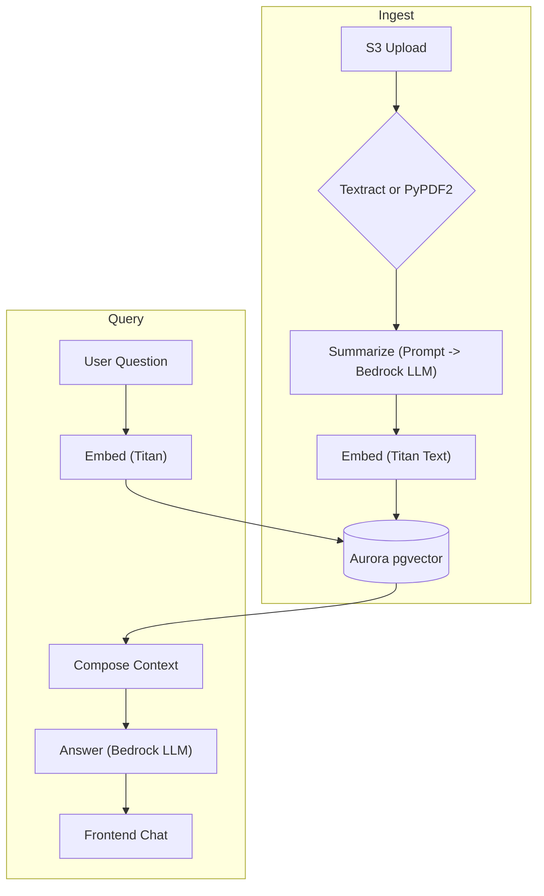

# Academic AI Agent + RAG (“academic‑agent‑rag”)

A full‑stack, serverless application for **uploading, indexing, and conversing with academic papers**.  
Built for cost‑efficiency on AWS, the project couples a Retrieval‑Augmented Generation (RAG) backend with a modern React web client.

[//]: # (![Architecture Diagram]&#40;docs/architecture.png&#41;)

<p align="center">
  <a href="LICENSE"></a>
  
  
</p>

---

## Table of Contents

1. [Features](#features)  
2. [High‑Level Architecture](#high-level-architecture)  
3. [Tech Stack](#tech-stack)  
4. [Getting Started](#getting-started)  
5. [Repository Layout](#repository-layout)  
6. [Configuration](#configuration)  
7. [CI / CD](#ci--cd)  
8. [Testing](#testing)  
9. [Cost Guardrails](#cost-guardrails)  
10. [Security & Compliance](#security--compliance)  
11. [Roadmap](#roadmap)  
12. [Contributing](#contributing)  
13. [License](#license)

---

## Features

| Category | Details |
|----------|---------|
| **Paper ingest** | Upload PDFs via drag‑and‑drop; automatic text extraction (Textract / PyPDF2) |
| **Search & QA** | Hybrid metadata + vector search (pgvector); Titan embeddings; Claude/Command‑R answer synthesis |
| **Web UI** | Next.js 14 (App Router), Tailwind CSS, dark‑mode |
| **Internet discovery** | Lambda crawler for arXiv / Semantic Scholar; one‑click import into your corpus |
| **Multi‑tenant** | Amazon Cognito auth; per‑user S3 prefixes and row‑level security |
| **Serverless cost model** | Aurora Serverless v2, API Gateway + Lambda, Step Functions Express |
| **DevEx** | CDK IaC, Docker Compose mocks, pre‑commit linting, GitHub Actions |

---

## High‑Level Architecture



---

## Tech Stack

| Layer | Technology | Reasoning |
|-------|------------|-----------|
| **Frontend** | Next.js 14, React 18, Tailwind CSS | Static hosting, fast DX |
| **Auth** | Amazon Cognito OAuth2 | Managed user pools, MFA |
| **API** | API Gateway REST / Lambda (Python 3.12) | Pay‑per‑ms, easy rollbacks |
| **Workflow** | AWS Step Functions Express | Event‑driven pipeline |
| **Storage** | S3, Aurora PostgreSQL v2 + pgvector | Cheap, scales to 15 M docs |
| **Vector Search** | pgvector `ivfflat` index; optional OpenSearch | Start cheap, upgrade later |
| **LLM & Embeddings** | Amazon Bedrock (Claude Haiku or Command R; Titan Text Embeddings) | On‑demand token billing |
| **IaC & CI** | AWS CDK v2 (TypeScript), GitHub Actions | Unified infra‑app repo |

---

## Getting Started

### 1 – Prerequisites

| Tool | Version | Notes |
|------|---------|-------|
| Node.js | ≥ 18 LTS | `n` or `asdf` recommended |
| Python | 3.12 | Managed by `pyenv` or `asdf` |
| Poetry | ≥ 1.7 | Python dependency mgmt |
| AWS CLI | ≥ 2.13 | Auth via SSO / profiles |
| AWS CDK | v2 globally | `npm i -g aws-cdk@2` |
| Docker Desktop | latest | Local mocks |

### 2 – Bootstrap

```bash
git clone https://github.com/your-org/academic-agent-rag.git
cd academic-agent-rag
make bootstrap         # installs Node, Poetry, CDK into a dev container
cp .env.example .env   # fill in AWS profile, region, stage
```

### 3 – Local Development

```bash
make dev               # docker-compose + localstack + pgvector
open http://localhost:3000
```

* Hot‑reloads for both Next.js (`pnpm dev`) and Lambdas (`sam local start-lambda`).

### 4 – Deploy to AWS (dev stage)

```bash
export AWS_PROFILE=dev-sandbox
make deploy STAGE=dev
# CDK synthesises & deploys all stacks
```

### 5 – Destroy

```bash
make nuke STAGE=dev    # cdk destroy --all
```

---

## Repository Layout

| Path | Description |
|------|-------------|
| `/infrastructure` | AWS CDK app – one stack per domain (data, api, ingest…) |
| `/packages/frontend` | Next.js client (TypeScript, React Query, Auth helpers) |
| `/packages/lambdas` | Python Lambda handlers (chat, ingest trigger, crawler…) |
| `/packages/shared-python` | Re‑usable Bedrock & pgvector helpers (Poetry package) |
| `/packages/stepfunctions` | ASL definitions for workflows (`.asl.json`) |
| `/tests` | Unit, integration (localstack), load (Artillery) |
| `/scripts` | One‑off utilities (DB seeding, data migration) |
| `.github/workflows` | CI, CD, nightly e2e pipelines |
| `docker-compose.dev.yml` | Local mocks: LocalStack, Postgres + pgvector, MinIO |

---

## Configuration

All runtime settings are **12‑factor** environment variables.

| Variable | Purpose | Example |
|----------|---------|---------|
| `STAGE` | `dev` \| `prod` | |
| `AWS_REGION` | AWS region | `us-east-1` |
| `UPLOAD_BUCKET` | S3 bucket for PDFs | `academic-dev-uploads` |
| `DB_SECRET_NAME` | RDS Secrets Manager name | `academic/dev/aurora` |
| `BEDROCK_MODEL_ID` | Claude, Command R, etc. | `anthropic.claude-3-haiku-20240229-v1:0` |
| `EMBEDDING_MODEL_ID` | Titan Text Embeddings | `amazon.titan-embed-text-v1` |

Local `.env` is **never** committed; `cdk.json` injects defaults during synth.

---

## CI / CD

| Stage | Workflow | Highlights |
|-------|----------|------------|
| **Lint & Type-Check** | `ci.yml` | Ruff, Black – Python; ESLint, tsc – TS |
| **Unit Tests** | `ci.yml` | PyTest; Jest (frontend) |
| **Synth & Diff** | `ci.yml` | Fails if CDK diff not empty / unapproved |
| **Dev Deploy** | `deploy-dev.yml` | Auto on push to `main`; CDK deploy to `dev` account |
| **Nightly E2E** | `e2e-nightly.yml` | Cypress vs. live stack; Artillery load run |

---

## Testing

```bash
poetry run pytest tests/unit
pytest tests/integration -m "localstack"
npm run test:frontend   # Jest + React Testing Library
artillery run tests/load/chat-10rps.yml
```

---

## Cost Guardrails

* **Aurora v1 auto-pause** to 0 ACU on idle.  
* **Bedrock batch embeddings** (≈ 50% cheaper).  
* **Lambda concurrency ceilings** via CDK `reservedConcurrentExecutions`.  
* **AWS Budgets** alarm → Slack / SNS (see `observability-stack.ts`).  

Starter footprint ≈ **$30 USD / mo** for a research group (<1k papers, 1k QPS burst).

---

## Security & Compliance

* Amazon Cognito MFA, OAuth2 PKCE flow  
* S3 & RDS encryption (SSE-KMS) + VPC endpoints  
* IAM least privilege (principle of least access in CDK)  
* Bedrock Guardrails + content moderation  
* GDPR/FERPA ready: per-user hard delete & audit trail (CloudTrail)

---

## Roadmap

- [ ] **UI** – citations-view + inline PDF reader  
- [ ] **OpenSearch** – switch at 10 M vectors or heavy similarity load  
- [ ] **Fine-tune** open-source LLM via SageMaker JumpStart  
- [ ] **Plugin API** – export REST hooks for custom ingest enrichers  
- [ ] **Notebook** – JupyterLab federated extension for programmatic access

---

## Contributing

1. Fork & clone the repo  
2. `make bootstrap`  
3. Create a feature branch (`feat/<slug>`)  
4. Commit with Conventional Commits (`git cz`)  
5. Open a pull request – CI must pass & at least one review required

Please read `CONTRIBUTING.md` for full guidelines.

---

## License

This project is licensed under the **MIT License** – see [`LICENSE`](LICENSE) for details.
