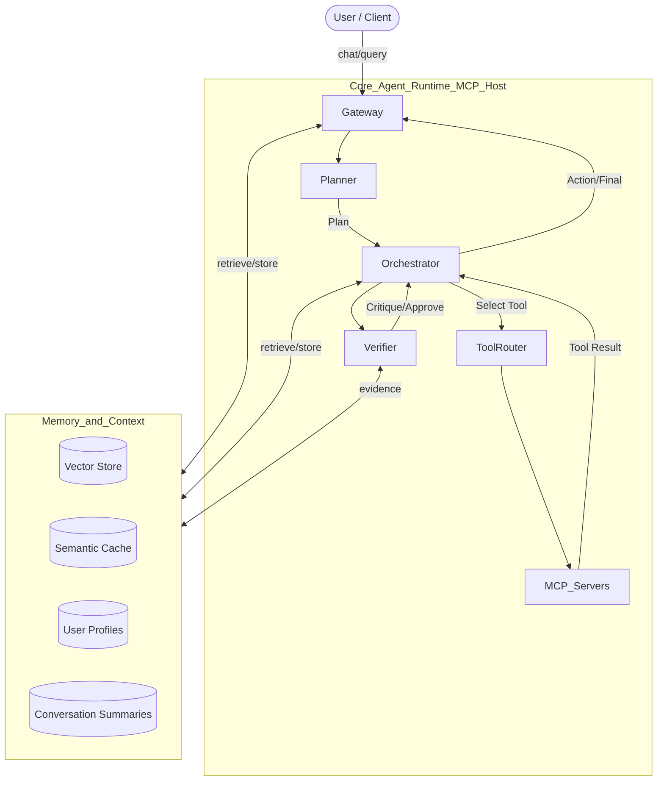

# Academic Agent RAG – MCP‑Native, Orchestrated, and Verifiable

A modern, MCP‑native AI agent system for academic research that combines Retrieval‑Augmented Generation (RAG) with robust tool orchestration, planner/verifier loops, and layered memory/context handling. The design is framework‑agnostic and interoperates with LangChain/LangGraph, CrewAI, and AutoGen via the Model Context Protocol (MCP).

---

## Why this redesign

- Unify tooling behind MCP so agents invoke APIs/DBs/files/search/RAG through a single protocol boundary.
- Introduce planner/verifier loops for reliable, auditable execution with corrective feedback.
- Strengthen memory/context handling for grounded responses and cost/latency control.
- Remain framework‑flexible: LangGraph for control flow; reuse LangChain tools/retrievers; plug in CrewAI/AutoGen sub‑agents.

---

## High‑Level Architecture

- MCP Host: Runs the model and routes MCP tool calls (local servers/adapters or IDE‑embedded tools).
- Planner: Produces a structured plan (steps, tools, expected evidence, stop criteria).
- Orchestrator (LangGraph): Executes steps, manages retries/branching, and memory I/O.
- Verifier: Scores outputs against plan/evidence; requests refinements or re‑planning before finalization.
- Memory: Short‑term scratchpad, episodic vector memory, semantic cache, user profiles, and rolling summaries.

---

## Tool Orchestration (MCP + adapters)

- Primary interface: MCP tools (search, RAG retrieval, file I/O, HTTP, code, DB) exposed as MCP servers.
- Adapters:
  - Wrap LangChain tools/retrievers as MCP tools for uniform access.
  - Wrap CrewAI/AutoGen sub‑agents as higher‑level MCP tools when tasks benefit from delegation.
  - Provide first‑class utilities (arXiv, Crossref, Semantic Scholar, Postgres/pgvector, object storage, filesystem).
- Routing policy: static capability map with optional embedding‑based intent routing; tool safety via allow‑list, rate limits, and input validation.

---

## Planner / Verifier Loops

- Planner defines goals, steps, tools per step, required evidence, and stop conditions.
- Orchestrator executes steps, aggregates results/evidence, and updates the scratchpad.
- Verifier enforces grounding and policy compliance; can trigger retries, additional evidence collection, or re‑planning.
- Finalization occurs only after verifier approval; answers include citations and rationale.

---

## Memory and Context Handling

- Short‑term scratchpad: distilled working notes across steps (not user‑visible chain‑of‑thought).
- Episodic memory: vector store of prior interactions for grounding and continuity.
- Semantic cache: memoize expensive prompt+tool pairs to reduce cost and latency.
- Conversation summaries: rolling summaries to respect context windows.
- User profile/context: roles, preferences, constraints, and allowed tools used by planner and verifier.
- Stores: pgvector/FAISS/Chroma for vectors; Redis/SQLite for cache; SQLite/Postgres for plans/runs/audit.

---

## Framework Interoperability

- LangChain: use loaders/retrievers/tools and memory implementations via MCP adapters.
- LangGraph: execution backbone (graph control flow, retries, branches, checkpointing).
- CrewAI/AutoGen: specialized sub‑agents exposed as MCP tools; the verifier can act as a judge when debate/critique helps.
- All framework usage occurs behind MCP where possible; otherwise provide thin adapter servers.

---

## Example MCP Tools (baseline)

- `rag.retrieve`: semantic retrieval over your corpus, returning chunks and citations.
- `papers.search`: internet discovery (arXiv, Crossref, Semantic Scholar) returning metadata/links.
- `papers.fetch`: fetch and parse PDFs, extract text and metadata.
- `notes.write` / `notes.read`: persistent notes for iterative research.
- `db.query`: SQL over Postgres/pgvector for advanced filters.

Each tool declares its schema, limits, safety policy, and test vectors.

---

## Configuration

- LLM provider/model IDs and credentials.
- Embeddings model and vector store configuration.
- Cache URL and policy (TTL/size/eviction).
- MCP server registry (addresses, transports, health checks).
- Policy mode (strict/permissive) for tool gating and guardrails.

---

## Getting Started (local)

- Prepare a Python 3.12 environment and install dependencies for MCP, orchestration, memory, and API hosting.
- Stand up a vector store (local FAISS/Chroma, or Postgres+pgvector) and an optional cache (Redis/SQLite).
- Implement and register baseline MCP servers (`rag.retrieve`, `papers.search`, `notes.*`, `db.query`).
- Run the API gateway and MCP host; expose a `/chat` endpoint that invokes the planner/orchestrator.
- Add health checks and minimal tool contract tests.

---

## Repository Layout (proposed)

| Path | Description |
|------|-------------|
| `/app` | API gateway (FastAPI) and MCP host bootstrap |
| `/agents` | Planner, Orchestrator (LangGraph), Verifier nodes |
| `/tools/mcp_servers` | MCP tool servers (RAG, papers, notes, db) |
| `/adapters` | Wrappers for LangChain, CrewAI, AutoGen as MCP tools |
| `/memory` | Vector store, cache, summaries, profile store |
| `/configs` | Tool manifests, safety policies, routing configs |
| `/tests` | Unit/integration tests and tool test vectors |

---

## Security & Safety

- Tool allow‑list and strict schema validation.
- Verifier‑enforced grounding with explicit evidence or calibrated uncertainty.
- Rate‑limits and budgets per tool and per user.
- Tracing/metrics and audit logs for plans, tool calls, and token usage.

---

## Migration Notes

- Removed AWS‑specific directories: `academic-agent-infra/` and `lambda/`.
- Internet discovery now lives behind `papers.search` and `papers.fetch` MCP tools.
- RAG is provider‑agnostic; embeddings/models and vector stores are configurable.

---

## Roadmap

- [ ] Baseline MCP servers: `rag.retrieve`, `papers.search`, `notes.write`.
- [ ] LangGraph execution with retries and checkpointing.
- [ ] Verifier with hybrid (rule + LLM) scoring.
- [ ] Semantic cache and conversation summarizer.
- [ ] CrewAI/AutoGen sub‑agent adapter examples.

---

## License

MIT
